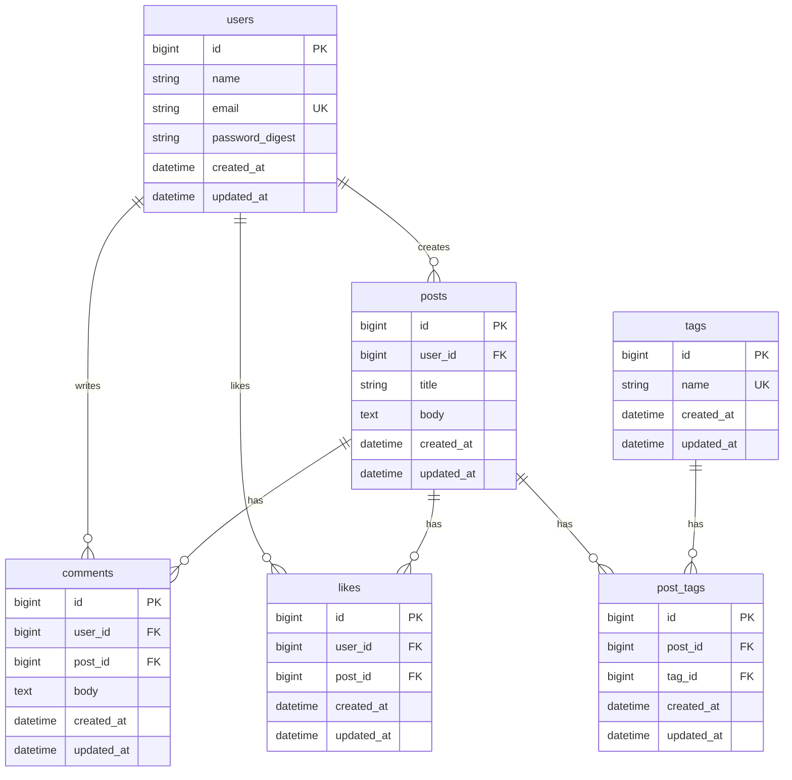

# tech_share_api

`tech_share` は、Qiita や Zenn のように技術的な知見を投稿・共有・議論できる掲示板型ナレッジ共有アプリです。  
このディレクトリは **Rails API バックエンド**を実装するための開発用 README です。

本プロジェクトは、以下を主目的にした学習開発です。

- Rails (API モード) の設計と実装を体系的に学ぶ
- React フロントエンドとの API 連携を前提にバックエンドを構築する

---

## 1. バックエンドの役割

`tech_share_api` は、以下の責務を持ちます。

- 認証・認可
- 記事投稿/編集/削除
- コメント投稿/削除
- タグ管理
- いいね管理
- 検索・一覧取得
- API レスポンス設計とバリデーション

フロントエンド (`tech_share_client`) は本 API を利用して画面表示・操作を行います。

---

## 2. 想定技術スタック (バックエンド)

- Ruby: 3.3 系
- Rails: 8.x (API mode)
- DB: PostgreSQL
- 認証: JWT ベース (例: `devise` + `devise-jwt`、または `bcrypt` + 自前実装)
- テスト: RSpec
- API ドキュメント: OpenAPI (rswag など) もしくは README ベース
- 静的解析: RuboCop

学習優先のため、実装は「まずシンプルに動く構成」を目指し、必要に応じて拡張します。

---

## 3. MVP の要件定義

まずは MVP (最小実用版) として以下を実装します。

### 3.1 ユーザー

- ユーザー登録
- ログイン / ログアウト
- ユーザープロフィール取得

### 3.2 記事

- 記事の作成
- 記事の一覧取得 (新着順)
- 記事の詳細取得
- 記事の更新 (投稿者本人のみ)
- 記事の削除 (投稿者本人のみ)

### 3.3 コメント

- 記事へのコメント作成
- コメント削除 (投稿者本人 or 記事投稿者)
- 記事詳細にコメント一覧を含める

### 3.4 タグ

- 記事に複数タグを付与可能
- タグ単位で記事絞り込み

### 3.5 いいね

- 記事へのいいね/いいね解除
- 記事ごとのいいね数取得

### 3.6 検索

- タイトル部分一致検索
- 本文部分一致検索

---

## 4. 非機能要件 (学習開発向け)

- RESTful な API 設計を守る
- 例外時は統一フォーマットで JSON を返す
- N+1 問題を避ける (`includes` など)
- バリデーションエラーを明確なメッセージで返す
- テストを書きながら実装する (最低限 Model/Request spec)

---

## 5. ドメインモデル (初期案)

- User
	- has_many :posts
	- has_many :comments
	- has_many :likes
- Post
	- belongs_to :user
	- has_many :comments
	- has_many :likes
	- has_many :post_tags
	- has_many :tags, through: :post_tags
- Comment
	- belongs_to :user
	- belongs_to :post
- Like
	- belongs_to :user
	- belongs_to :post
- Tag
	- has_many :post_tags
	- has_many :posts, through: :post_tags
- PostTag
	- belongs_to :post
	- belongs_to :tag

### 5.1 ER 図 (Mermaid)



---

## 6. API エンドポイント案 (v1)

ベース URL: `/api/v1`

### 認証

- `POST /auth/signup` : 新規登録
- `POST /auth/login` : ログイン
- `DELETE /auth/logout` : ログアウト
- `GET /auth/me` : 自分のユーザー情報取得

### 記事

- `GET /posts` : 記事一覧
- `POST /posts` : 記事作成
- `GET /posts/:id` : 記事詳細
- `PATCH /posts/:id` : 記事更新
- `DELETE /posts/:id` : 記事削除

### コメント

- `POST /posts/:post_id/comments` : コメント作成
- `DELETE /posts/:post_id/comments/:id` : コメント削除

### いいね

- `POST /posts/:post_id/like` : いいね
- `DELETE /posts/:post_id/like` : いいね解除

### タグ/検索

- `GET /tags` : タグ一覧
- `GET /posts?tag=rails` : タグ絞り込み
- `GET /posts?q=jwt` : キーワード検索

---

## 7. データ設計ルール (初期)

- `users.email` は unique
- `posts` は `title` (必須), `body` (必須)
- `likes` は `(user_id, post_id)` の複合 unique
- `tags.name` は unique
- 論理削除は導入せず、まずは物理削除で実装

---

## 8. レスポンスフォーマット方針

成功時:

```json
{
	"data": {},
	"meta": {}
}
```

失敗時:

```json
{
	"errors": [
		{
			"code": "validation_error",
			"message": "Title can't be blank"
		}
	]
}
```

まずは形式の統一を優先し、詳細なエラーコード設計は段階的に行います。

---

## 9. 開発ステップ (推奨順)

1. Rails API プロジェクト初期化
2. 認証機能実装 (signup/login/me)
3. Post CRUD
4. Comment 機能
5. Tag 機能
6. Like 機能
7. 検索機能
8. テスト強化・リファクタ

---

## 10. 開発コマンド (予定)

```bash
# セットアップ
bundle install
rails db:create db:migrate

# サーバー起動
rails s

# テスト
bundle exec rspec

# 静的解析
bundle exec rubocop
```

実際のコマンドは、初期セットアップ後に必要に応じて更新します。

---

## 11. 学習観点チェックリスト

- [ ] Rails の MVC と API モードの違いを説明できる
- [ ] ActiveRecord の関連とバリデーションを使いこなせる
- [ ] JWT 認証フローを説明できる
- [ ] N+1 の検出と解消ができる
- [ ] Request spec で API 品質を担保できる
- [ ] React 側から API を使ったときの CORS/認証問題を解決できる

---

## 12. 今後の拡張候補

- ストック機能 (ブックマーク)
- フォロー機能
- 通知機能
- Markdown 対応
- 画像アップロード
- 下書き/公開ステータス
- 管理者権限

MVP 完成後に、優先度を決めて段階的に実装します。
